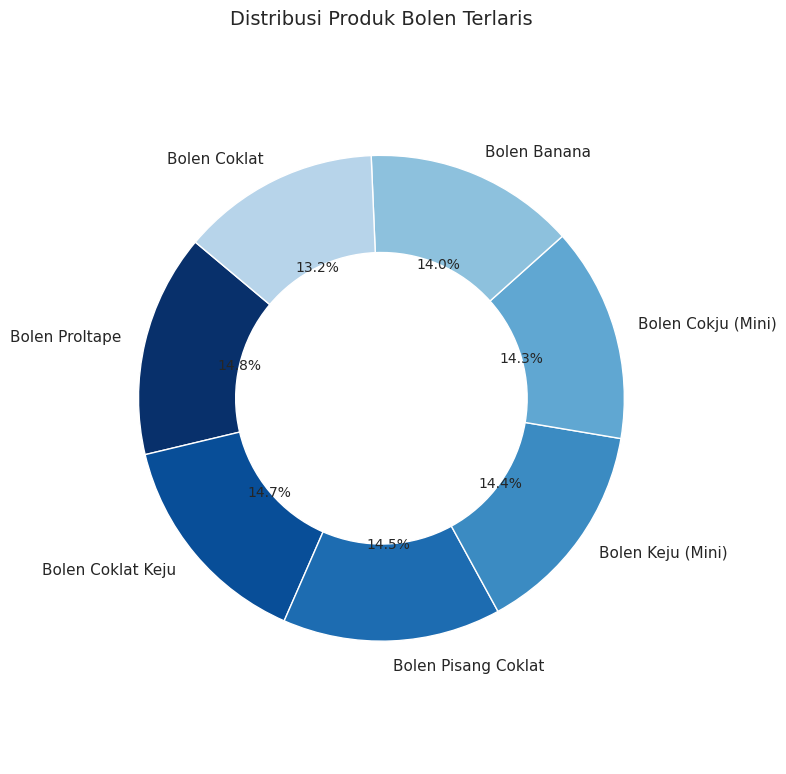
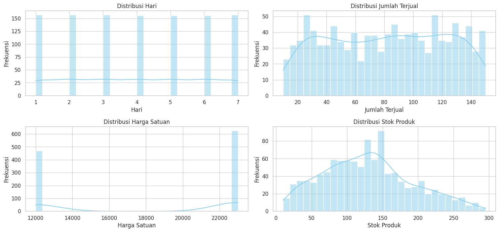
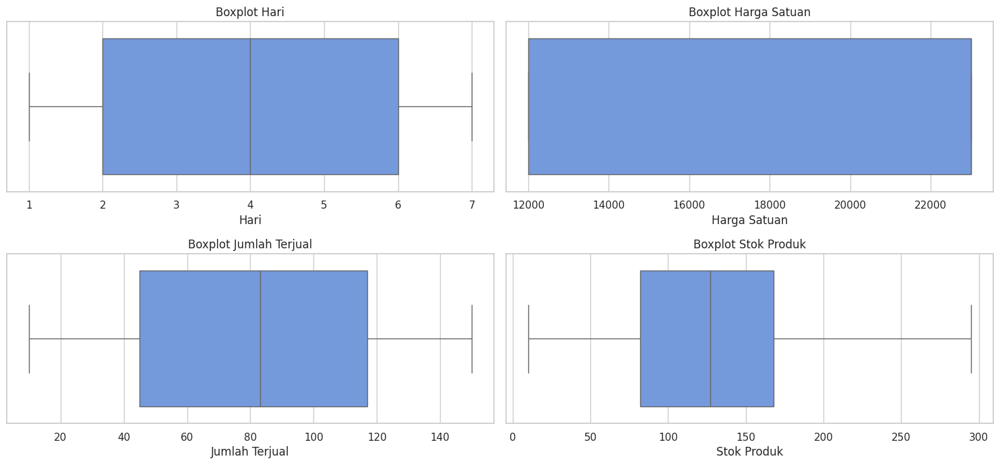
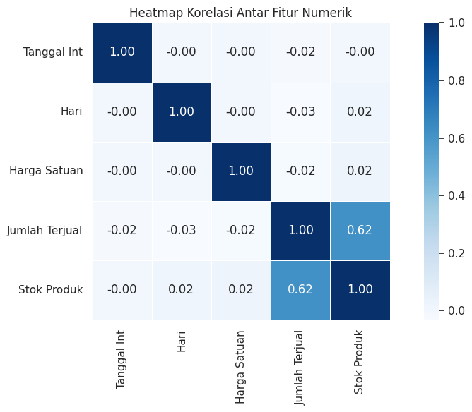
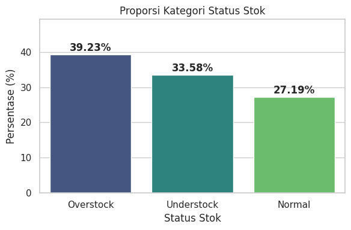
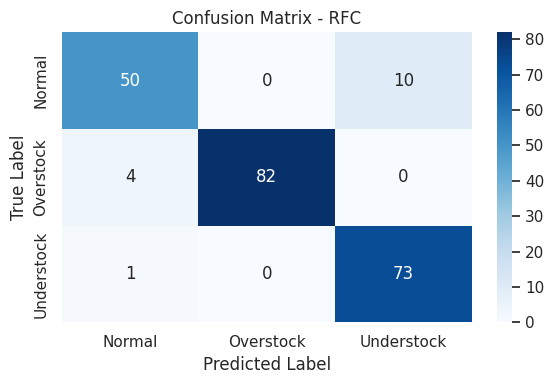
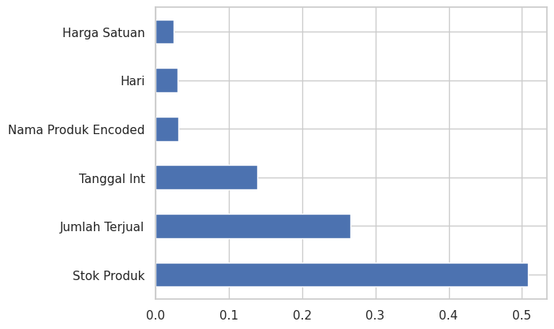

# PENERAPAN ALGORITMA RANDOM FOREST CLASSIFIER UNTUK PREDIKSI STOK PENJUALAN PRODUK BOLEN CRISPY
Project ini dibuat untuk memenuhi persyaratan Ujian Akhir Semester pada mata kuliah Machine Learning

## Latar Belakang
UMKM seperti Bolen Crispy menghadapi masalah dalam mengelola stok akibat permintaan yang fluktuatif. Pengelolaan yang masih manual sering menyebabkan overstock atau understock, yang berdampak pada pemborosan biaya maupun kehilangan potensi penjualan. Untuk mengatasi permasalahan tersebut, dibutuhkan sistem prediktif berbasis data yang mampu membantu manajemen dalam menentukan status stok secara akurat dan efisien.

Algoritma Random Forest Classifier dipilih karena mampu menangani data kompleks dan memberikan hasil klasifikasi yang tepat. Berdasarkan kajian jurnal dan penelitian, algoritma ini terbukti efektif dalam meningkatkan efisiensi stok dan prediksi penjualan. 

## Tujuan
1. Menerapkan algoritma Random Forest Classifier untuk memprediksi status stok produk Bolen Crispy.

2. Mengembangkan sistem prediksi berbasis web untuk mendukung pengambilan keputusan manajemen persediaan.

3. Menilai akurasi dan performa model dalam sistem prediksi stok.

## Dataset
Dataset yang digunakan merupakan data penjualan produk Bolen Crispy yang berisi:

1. Tanggal
2. Hari
3. Nama Produk
4. Jumlah Terjual
5. Harga Satuan
6. Stok Produk

## Data Preprocessing
### Identifikasi Struktur Dataset
1. Dataset ini berisi 6 kolom dan 1096 baris
2. Data ini tidak memiliki data duplikat
3. Data ini tidak memiliki missing value
4. Informasi tipe data:
   a. Tanggal (object)
   b. Hari (object)
   c. Nama Produk (object)
   d. Jumlah Terjual (integer)
   e. Harga Satuan (integer)
   f. Stok Produk (integer)

### Konversi Tipe Data
1. Tanggal

Kolom Tanggal awalnya memiliki format string yang perlu dikonversi agar bisa digunakan dalam analisis dan pemodelan machine learning. Oleh karena itu, kolom ini terlebih dahulu diubah menjadi tipe data datetime agar data bisa dianalisis berdasarkan waktu seperti melihat tren bulanann atau mingguan. Setelah itu, kolom Tanggal yang telah menjadi datetime dikonversi lagi menjadi bentuk numerik (integer). Hasil konversi ini disimpan dalam kolom baru bernama Tanggal Int.

2. Hari

Nama hari dikonversi menjadi angka untuk mempermudah proses analisis dan pemodelan karena model machine learning tidak bisa memproses data kategorikal bertipe string.

### Penjualan Produk

 
 
Berdasarkan visualisasi diatas, terlihat bahwa semua varian produk bolen memiliki proporsi penjualan yang cukup merata, dengan Bolen Proltape menjadi yang paling laris sebesar 14,8%. Perbedaan antar produk tidak terlalu signifikan, yang menunjukkan bahwa seluruh varian bolen memiliki minat pasar yang relatif seimbang. Hal ini dapat menjadi peluang untuk mempertahankan ketersediaan semua varian secara konsisten.

### Distribusi data numerik dengan Histogram

 

Dari gambar di atas, dapat disimpulkan bahwa:

1. Distribusi hari menunjukkan frekuensi yang hampir merata dari hari 1 hingga hari 7, menandakan tidak ada perbedaan signifikan dalam jumlah data per hari.
2. Distribusi jumlah terjual cenderung normal dan merata dengan sedikit kecenderungan ke sisi kanan, menunjukkan bahwa sebagian besar produk terjual dalam rentang 40–140 unit per hari.
3. Distribusi harga satuan menunjukkan hanya dua puncak yang dominan, yaitu di Rp12.000 dan Rp23.000, mencerminkan bahwa produk-produk yang dijual memiliki dua kategori harga yang sangat konsisten.
4. Distribusi stok produk cenderung skewed ke kanan (positif), artinya ada lebih banyak produk dengan stok menengah hingga tinggi, namun masih terdapat sebagian kecil produk dengan stok yang sangat tinggi.

### Outliers
 

Dari boxplot di atas, dapat disimpulkan bahwa:

1. Distribusi Hari menunjukkan pola yang merata dari hari ke-1 hingga hari ke-7, dengan median berada di hari ke-4, menandakan tidak ada hari tertentu yang mendominasi aktivitas penjualan.

2. Distribusi Harga Satuan memiliki dua rentang harga utama, yaitu sekitar Rp12.000 dan Rp23.000, dan semuanya berada dalam rentang normal tanpa outlier. Ini mengindikasikan adanya dua kategori harga produk yang konsisten.

3. Distribusi Jumlah Terjual memiliki sebaran yang cukup lebar, mulai dari sekitar 10 hingga 150 unit. Tidak ditemukan outlier, yang menunjukkan kestabilan volume penjualan harian.

4. Distribusi Stok Produk menunjukkan kisaran stok dari sekitar 10 hingga hampir 300 unit. Sebaran cukup lebar namun tetap dalam batas wajar dan tidak terdapat nilai ekstrem.

### Correlation Feature

Berdasarkan korelasi heatmap di atas, terlihat bahwa sebagian besar fitur numerik memiliki hubungan korelasi yang sangat rendah (mendekati nol). Satu-satunya korelasi yang cukup kuat adalah antara Jumlah Terjual dan Stok Produk dengan nilai korelasi sebesar 0.62, yang menunjukkan adanya hubungan positif sedang, itu artinya semakin tinggi stok, cenderung semakin banyak produk yang terjual. Sisanya, seperti Hari, Harga Satuan, dan Tanggal Int, memiliki korelasi sangat lemah terhadap fitur lain.

### Feature Engineering
1. Membuat kolom status stok berdasarkan selisih antara stok produk dan jumlah terjual
Fitur Status Stok dibuat berdasarkan selisih antara Stok Produk dan Jumlah Terjual. Tujuannya adalah untuk mengkategorikan kondisi stok menjadi tiga kelas:

Understock: jika stok kurang atau habis (≤ 0),
Normal: jika stok masih dalam batas aman (1 hingga 50),
Overstock: jika stok berlebih (> 50).

Fitur ini penting untuk membantu dalam analisis ketersediaan produk, mengidentifikasi potensi kekurangan dan kelebihan stok dan fitur ini juga dapat dijadikan target variabel untuk model klasifikasi machine learning seperti Random Forest Classifier.

2. Menampilkan proporsi tiap kategori status stok dalam bentuk persentase

Berdasarkan visualisasi di atas, proporsi kategori Status Stok menunjukkan bahwa sebagian besar data berada pada kondisi Overstock (39.23%), diikuti oleh Understock (33.58%), dan hanya 27.19% yang berada pada kondisi stok Normal. Hal ini mengindikasikan bahwa mayoritas stok belum dikelola secara optimal, dengan kecenderungan terjadi kelebihan atau kekurangan stok yang dapat berdampak pada efisiensi operasional dan potensi kehilangan penjualan.

### Label Encoding
1. Status Stok
Mengubah nilai kategorikal pada kolom Status Stok menjadi bentuk numerik menggunakan Label Encoder, menghasilkan kolom baru bernama Status Stok Encoded. Tujuan dari proses ini adalah agar data dapat diproses oleh algoritma machine learning yang umumnya tidak menerima input bertipe string atau kategorikal. Encoding ini memungkinkan model memahami nilai kategori dalam format yang dapat dihitung dan dianalisis.

2. Nama Produk
Kolom Nama Produk di encoding dengan tujuan untuk mempermudah proses analisis dan pemodelan saat pemilihan fitur dan target variabel. Dengan mengubah nama produk ke bentuk numerik, model bisa memahami dan memproses fitur tersebut dalam proses pelatihan dan prediksi.

### Spliting Data
Data dibagi menjadi dua bagian: 80% untuk training dan 20% untuk testing. Proses ini dilakukan untuk memisahkan data yang akan digunakan untuk melatih model dan mengevaluasi performa model.

Teknik stratified splitting digunakan agar distribusi kelas pada target Status Stok Encoded tetap seimbang di kedua subset. Ini penting untuk mencegah model menjadi bias terhadap kelas tertentu, terutama ketika dataset memiliki ketidakseimbangan antar kelas.

### SMOTE (Synthetic Minority Oversampling Technique)
Sebelum dilakukan SMOTE, distribusi kelas pada target Status Stok Encoded terlihat tidak seimbang, di mana kelas 1 (Overstock) mendominasi dengan 344 data, kelas 2 (Understock) memiliki 294 data, sementara kelas 0 (Normal) hanya memiliki 238 data. Ketidakseimbangan ini dapat menyebabkan model cenderung bias dan kurang akurat dalam memprediksi kelas minoritas.

Setelah dilakukan SMOTE (Synthetic Minority Over-sampling Technique), jumlah data untuk setiap kelas disamakan menjadi 344, menghasilkan dataset yang seimbang. Dengan data yang seimbang, model klasifikasi memiliki peluang yang lebih adil dalam mempelajari pola dari setiap kelas dan menghasilkan prediksi yang lebih akurat dan tidak bias terhadap kelas mayoritas.

### Data Modelling
Data modeling dilakukan dengan Random Forest Classifier, menggunakan data hasil SMOTE dan class weight seimbang untuk mengatasi ketidakseimbangan kelas, lalu dilakukan prediksi pada data uji.

### Data Evaluation
Model klasifikasi yang dibangun menunjukkan performa yang bagus dengan akurasi, precision, dan F1 score sebesar 93%, serta recall sebesar 92%. Hasil ini mengindikasikan bahwa model mampu mengklasifikasikan status stok produk secara konsisten, baik dalam mengenali maupun memprediksi kategori dengan akurasi tinggi.

### Confusion Matrix

Model mampu mengklasifikasikan sebagian besar data dengan benar, ditunjukkan oleh tingginya nilai diagonal (benar prediksi):

- 50 data kategori Normal diprediksi dengan benar.

- 82 data kategori Overstock diprediksi dengan benar.

- 73 data kategori Understock diprediksi dengan benar.

Kesalahan klasifikasi terjadi sebagian kecil:

- 10 data kategori Normal diprediksi sebagai Understock.

- 4 data Overstock diprediksi sebagai Normal.

- 1 data Understock diprediksi sebagai Normal.

Secara keseluruhan, confusion matrix ini menunjukkan bahwa model Random Forest Classifier memiliki performa klasifikasi yang sangat baik, dengan jumlah prediksi yang salah relatif kecil dibandingkan total data.

### Classification Report
Classification report menunjukkan akurasi 93%, dengan nilai precision, recall, dan f1-score tinggi di semua kelas. Model bekerja konsisten dan seimbang.

### Feature Importance

Berdasarkan grafik feature importance dari model Random Forest Classifier, fitur yang paling berpengaruh terhadap hasil prediksi adalah Stok Produk dan Jumlah Terjual, yang menunjukkan bahwa kondisi awal stok dan angka penjualan sangat menentukan status stok akhir (understock, normal, atau overstock).

### Tech Stack
1. Python
2. Pandas
3. NumPy
4. Scikit-learn
5. Matplotlib
6. Seaborn
7. SQLite
8. Laravel
9. PHP
10. jQuery
11. Tailwind CSS
12. Sweetalert2
13. REST API + Flask

### Kesimpulan
Penerapan Random Forest Classifier terbukti efektif dalam memprediksi status stok produk Bolen Crispy dengan akurasi 93%. Melalui penerapan SMOTE dan feature engineering, kualitas dataset meningkat sehingga model mampu memberikan prediksi yang lebih akurat dan seimbang. Sistem ini berpotensi diintegrasikan ke dalam sistem manajemen persediaan berbasis data untuk meningkatkan efisiensi dan mengurangi risiko overstock maupun understock.

## Saran untuk Pengembangan Selanjutnya
1. Mencoba algoritma lain seperti XGBoost atau Gradient Boosting untuk menemukan perbandingan akurasi yang lebih tinggi
2. Melakukan hyperparameter tuning lebih lanjut
3. Integrasi dengan dashboard monitoring real-time

